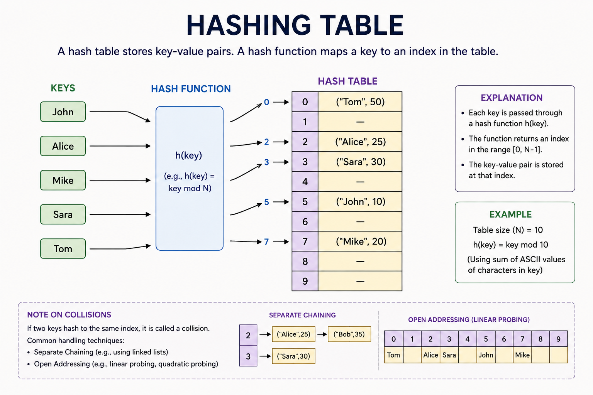

# Hasing Table

## Probing vs Chaning
**Probing (Open Addressing)** keeps everything inside the array. No extra memory is allowed. If a slot is taken, the item must wander around to find a different, empty slot somewhere else in the array.

**Chaining (Closed Addressing)** allows the array to grow outward. The slots act as doorways. If a slot is taken, you don't look for a new index. You just append the new item right next to the old one in a list at that exact same index.

## When Chain vs When Prob
#### Choose Chaining When:

- **You do not know how much data is coming**: Since chaining can grow infinitely using linked lists, the table will never crash or completely fill up [skills:load].

- **Frequent deletions occur**: Deleting an item from a linked list is clean and easy—you just unhook the node.

- **Memory blocks are cheap**: You have plenty of RAM to handle creating new nodes outside of the main table array.

#### Choose Probing When:

- **You have strict memory limits**: Everything must live inside the fixed-size array. No outside nodes or pointers are allowed, making it highly memory-efficient.

- **You need absolute maximum speed**: Because all data sits side-by-side in the array, the computer's CPU cache can read it incredibly fast. Chaining requires jumping around to random memory addresses, which is slower.

- **Data is rarely deleted**: Deleting items in probing is messy. You cannot just leave an empty space, or it will break the search path for other items. You have to fill the empty slot with a special marker called a "tombstone.

## A Simple Real-World Analogy
Imagine booking a room at a hotel:

**Probing** is like an aggressive hotel clerk. You book Room 101, but someone is already in it. The clerk says, "Too bad, walk down the hall and take Room 102 instead.

**Chaining** is like a bunk-bed hotel room. You book Room 101, but someone is already in it. The clerk says, "No problem, just climb up and take the top bunk in Room 101."

